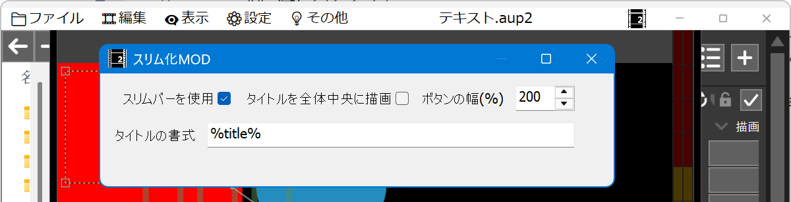

# 🐍AviUtl2 スリム化MOD

* aviutl2ウィンドウのタイトルバーとメニューバーを一体化してスリム化します。
* aviutl2の入力プラグインの形式になっていますが、実際には見た目を変えるタイプのMODです。

> [!IMPORTANT]
> * **本リポジトリ及びプログラムには`🐍AviUtl2プラグイン総合`の`README`の内容が適用されます。**
> * 必ず[こちら](https://github.com/hebiiro/al2)を読んでから使用してください。

## ⬇️ダウンロード

* [最新バージョンはこちら](../../releases/latest/)

## 🚀インストール

* `プラグインフォルダ`に以下のファイルを入れてください。
	* `al2` ✏️フォルダ
		* `al2_slimming.aui2` ✏️入力プラグインファイル

## 🔥アンインストール

* `プラグインフォルダ`から以下のファイルを削除してください。
	* `al2` ✏️フォルダ
		* `al2_slimming.aui2` ✏️このファイルを削除
		* `al2_slimming` ✏️このフォルダを削除

## 🔧設定項目

* `スリムバーを使用`✏️チェックを入れるとタイトルバーとメニューバーが一体化(スリムバー化)します。
* `タイトルを全体中央に描画`
	* ✏️チェックを入れるとスリムバーの中央にタイトルが描画されます。
	* ✏️チェックを入れてない場合はスリムバーの空きスペースの中央にタイトルが描画されます。
* `ボタンの幅(%)`✏️スリムバーのボタンの幅を高さを基準に%単位で指定します。
* `タイトルの書式`✏️スリムバーのタイトルの書式を指定します。
	* `%title%`は元のタイトル名に置換されます。

## 🔖更新履歴

* 🔖r2 #2026年02月03日
	* 🚚サブモジュール化
	* 🩹aviutl2起動時にレイアウトが崩れる問題に対応

* 🔖r1 #2026年01月28日
	* 🎉初版
